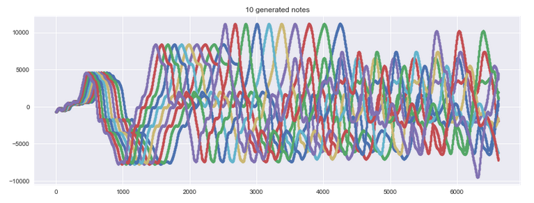

|  | 
|:--:| 
| *A3 on the Cello* |

# Pitch Perfect

author: Patrick Stetz [(gihub)](https://github.com/pstetz)

# Introduction:

This project takes a .wav music file and converts it to sheet music.

# Install:

### Clone repo unto your own folder

`git clone https://github.com/pstetz/Pitch-Perfect.git`

# Run:

- Open main.ipynb

- Fill in appropriate variables like input file (music being transcribed) and output path (for the sheet music)

- IMPORTANT: You need [MuseScore](https://musescore.org/en) to render the output XML into Sheet Music

# Background:

## Method 1: FFT

1.) Segments sound file into likely candidates for notes.

2.) Each note is individually looked at through Fast Fourier Transform (see below).

 

3.) The different frequencies are looked at to see if multiple notes were played at a time

4.) The duration of the note is determined either by how long it takes to get to the 25% loudness mark or until the next note is played

## Method 2: RNN

Currently not yet operable

## Data Generator

Included in this project is a data generator.  This Generator is able to take in a note from an instrument and convert it to all the other 107 pitches.  The motivation for this generator is to provide labeled data for the RNN method.

The Data Generator first takes in a note as input.  Next, it halves (and doubles) the frequency until we hit the bounds of musical frequencies.

|  | 
|:--:| 
| *All 7 octaves generated from 1 note* |

Each of these 7 octaves are then passed into a different function that stretches and compresses the notes to create a new sample at every half step.  For those interested, the frequency ratio of successive half notes is always the same 1.0595 or 2^(1/12).

|  | 
|:--:| 
| *10 notes generated from 1 note* |

# Resources:

 - For a thorough understanding of Music XML, please follow this [link](https://wpmedia.musicxml.com/wp-content/uploads/2017/12/musicxml-tutorial.pdf?_ga=2.160318969.598454358.1523905769-1890310323.1523905769)

